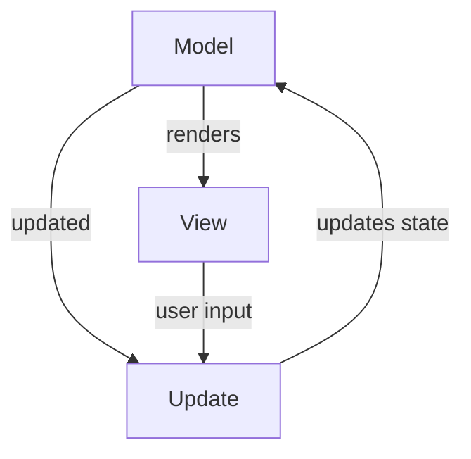

## Design architetturale

Analisi Architetturale: Model-Update-View (MUV) per l'Auto-Battler
L'architettura del sistema si basa sul pattern Model-Update-View (MUV), un'evoluzione del paradigma Functional Core, Imperative Shell. Questa scelta è stata fatta per massimizzare la testabilità, abbracciare l'immutabilità richiesta da Scala 3 e separare nettamente la logica di business pura dagli effetti collaterali (I/O).

Il sistema è diviso in due macro-livelli con responsabilità strettamente separate:

1. Il Nucleo Funzionale (Purezza e Immutabilità)
   Questo livello non ha alcuna conoscenza del mondo esterno, non stampa a video e non contiene variabili mutabili.

Model (GameState): Rappresenta l'intera "fotografia" dell'arena in un dato istante. È una struttura dati immutabile che contiene la Griglia, la lista delle Unità con le loro Statistiche correnti, l'ordine di turno e il log degli eventi.

Actions (Eventi): Un'Algebraic Data Type (enum) che modella ogni singola intenzione o evento possibile nel gioco (es. Sposta(Id, Coordinata), Attacca(Attaccante, Bersaglio)).

L'Intelligenza Artificiale (AI): Una funzione pura che osserva il GameState e decide la mossa ottimale per l'unità di turno, restituendo un'Azione.

Update (Il Motore delle Regole): Il cuore matematico del gioco. È una funzione pura che accetta lo Stato Corrente e un'Azione, applica le regole del gioco (calcolo danni, collisioni) e restituisce una nuova istanza di GameState.

2. Il Guscio Imperativo (Side-Effects e I/O)
   Questo è il punto di contatto con l'utente e il sistema operativo. Qui è confinata l'imprevedibilità.

View: Prende in input il GameState e si occupa unicamente di formattarlo e stamparlo sul terminale (o su una futura GUI).

Game Loop: Un ciclo tail-recursive che orchestra l'avanzamento del tempo. Ad ogni iterazione, chiama l'AI per ottenere un'Azione, passa l'Azione all'Update per ottenere il nuovo Stato, chiama la View per mostrarlo, e infine richiama se stesso passando il nuovo Stato.

