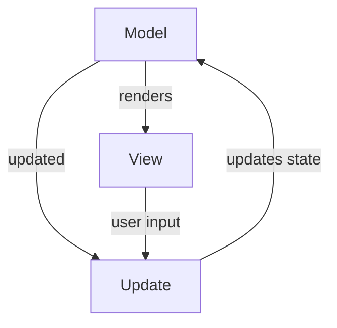

## Design architetturale

L'architettura del sistema si basa sul pattern 
**Model-Update-View** (MUV), un'evoluzione del paradigma 
*Functional Core*, Imperative Shell. Questa scelta è stata 
fatta per massimizzare la testabilità, abbracciare l'
immutabilità richiesta da Scala 3 e separare nettamente la
logica di business pura dagli effetti collaterali (I/O).

### Model
Il **Model** rappresenta lo stato del gioco, inclusi i 
dati relativi alla mappa, alle unità, alle statistiche e a
qualsiasi altra informazione necessaria per la simulazione.
E' progettato per essere completamente immutabile, 
il che significa che ogni modifica allo stato del gioco 
produce un nuovo modello invece di modificare quello 
esistente. Questo approccio facilita la gestione dello 
stato e rende più semplice il debug e i test.

### Update
L'**Update** è responsabile di gestire la logica di gioco e
di aggiornare il Model in risposta agli input dell'utente o
agli eventi di gioco. Questo componente contiene tutte le
regole di gioco, come il movimento delle unità, il calcolo
dei danni, la gestione dei turni e così via. L'Update 
riceve input dalla View e produce un nuovo Model basato su
tali input, mantenendo la logica di gioco separata dalla 
rappresentazione visiva.

### View
La **View** è responsabile di presentare lo stato del gioco
all'utente e di raccogliere i suoi input. Si occupa di 
tutto ciò che riguarda l'interfaccia utente, inclusa la
visualizzazione della mappa, delle unità e dei log di 
gioco. E' progettata per essere il più possibile 
indipendente dal Model e dall'Update, in modo da poter 
essere facilmente modificata o sostituita senza influire 
sulla logica di gioco sottostante.

### Vantaggi dell'architettura Model-Update-View
L'adozione del pattern *MUV* ci permette di mantenere una 
chiara separazione delle responsabilità tra i componenti 
del sistema, facilitando la manutenzione, l'estensibilità
e la testabilità del codice.

Inoltre, l'approccio immutabile del Model contribuisce a 
ridurre i bug legati alla gestione dello stato e a 
migliorare la prevedibilità del comportamento del sistema 
nel tempo.

Il design modulare consente di aggiungere facilmente nuove
viste (es. una GUI), nuove modalità di input, o nuove 
strategie e abilità di gioco senza alterare la logica di 
base del Model.

Ogni componente può essere testato in isolamento, 
facilitando l’identificazione e la correzione dei bug.