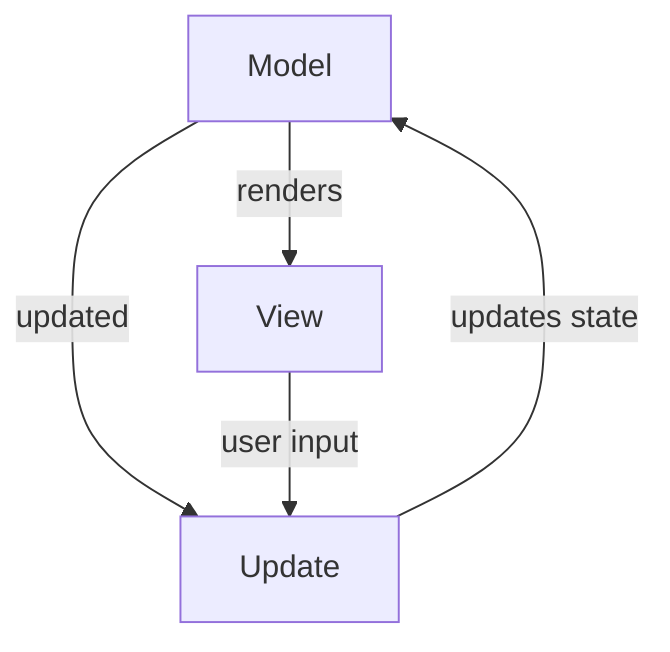

## Design architetturale

L'architettura del sistema si basa sul pattern Model-Update-View (MUV), un'evoluzione del paradigma Functional Core, 
Imperative Shell. Questa scelta è stata fatta per massimizzare la testabilità, 
abbracciare l'immutabilità richiesta da Scala 3 e separare nettamente la logica di business pura 
dagli effetti collaterali (I/O).

