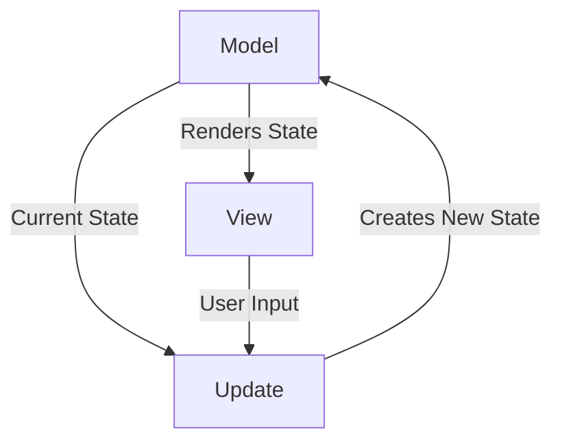
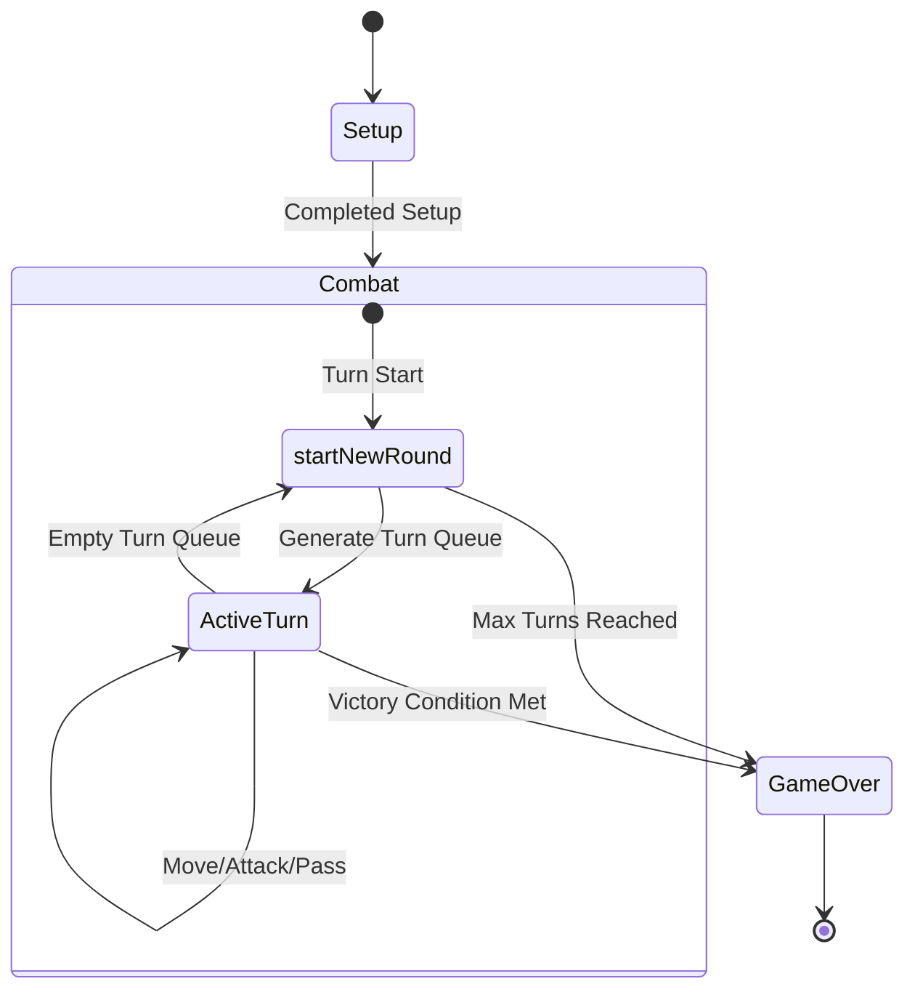

# Design architetturale

L'architettura del sistema si basa sul pattern 
**Model-Update-View** (MUV), un'evoluzione del paradigma 
*Functional Core, Imperative Shell*. Questa scelta è stata 
fatta per abbracciare l'immutabilità richiesta da Scala 3 
e separare nettamente la logica di business pura dagli 
effetti collaterali (I/O).

## Model
Il **Model** rappresenta lo stato del gioco, inclusi i 
dati relativi alla mappa, alle unità, alle statistiche e a
qualsiasi altra informazione necessaria per la simulazione.
È progettato per essere completamente immutabile, 
il che significa che ogni modifica allo stato del gioco 
produce un nuovo modello invece di modificare quello 
esistente. Questo approccio facilita la gestione dello 
stato e rende più semplice il debug e i test.

## Update
L'**Update** è responsabile di gestire la logica di gioco e
di aggiornare il Model in risposta agli input dell'utente o
agli eventi di gioco. Questo componente contiene tutte le
regole di gioco, come il movimento delle unità, il calcolo
dei danni, la gestione dei turni e così via. L'Update 
riceve input dalla View e produce un nuovo Model basato su
tali input, mantenendo la logica di gioco separata dalla 
rappresentazione visiva.

## View
La **View** è responsabile di presentare lo stato del gioco
all'utente e di raccogliere i suoi input. Si occupa di 
tutto ciò che riguarda l'interfaccia utente, inclusa la
visualizzazione della mappa, delle unità e dei log di 
gioco. È progettata per essere il più possibile 
indipendente da Model e Update, in modo da poter 
essere facilmente modificata o sostituita senza influire 
sulla logica di gioco sottostante.

## Ciclo di vita e fasi di gioco

Questo diagramma illustra le fasi principali del ciclo di vita del gioco,
dalla fase di setup iniziale, attraverso i round di combattimento, fino alla conclusione del gioco.

## Vantaggi dell'architettura Model-Update-View
L'adozione del pattern MUV e del paradigma funzionale 
offre i seguenti vantaggi:
1. **Separazione delle Responsabilità**: la logica di gioco è testabile in totale isolamento senza 
dover istanziare componenti grafici o dipendenze di I/O.
2. **Prevedibilità**: grazie all'immutabilità, dato uno stato S e un input I, 
l'`Engine` produrrà sempre lo stesso nuovo stato S'.
3. **Estendibilità Grafica**: il design modulare consente di aggiungere facilmente nuove viste 
(ad esempio passando da una console a una GUI in ScalaFX/Swing) senza alterare la logica del modello.