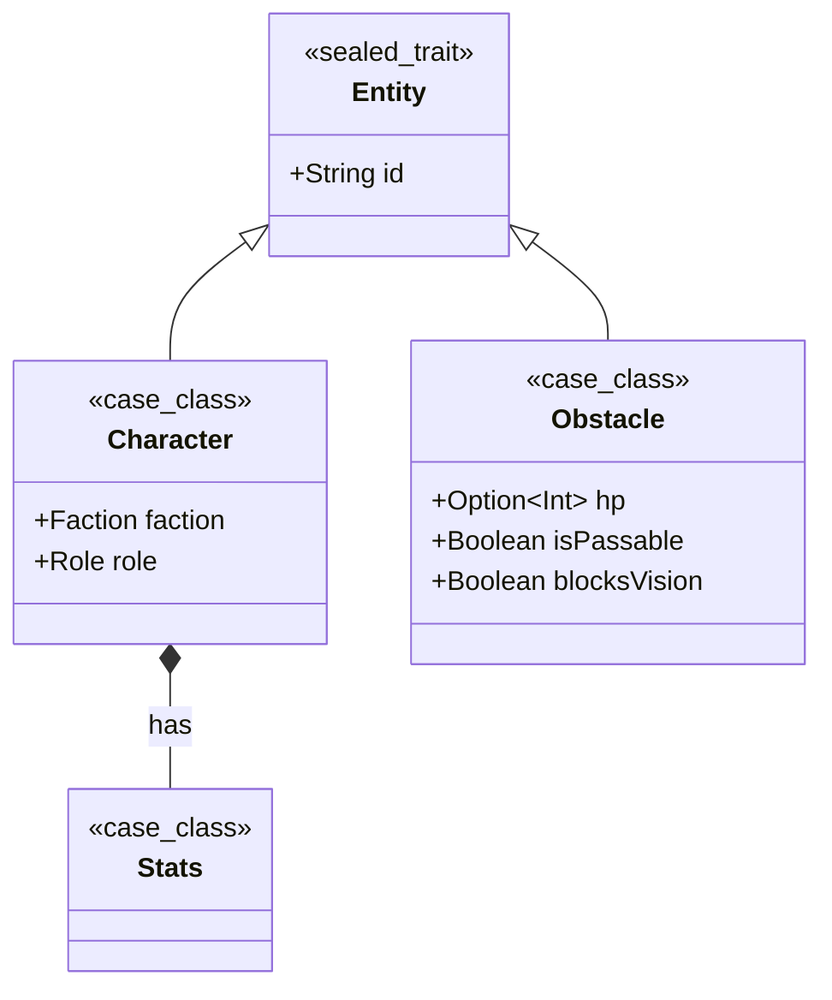
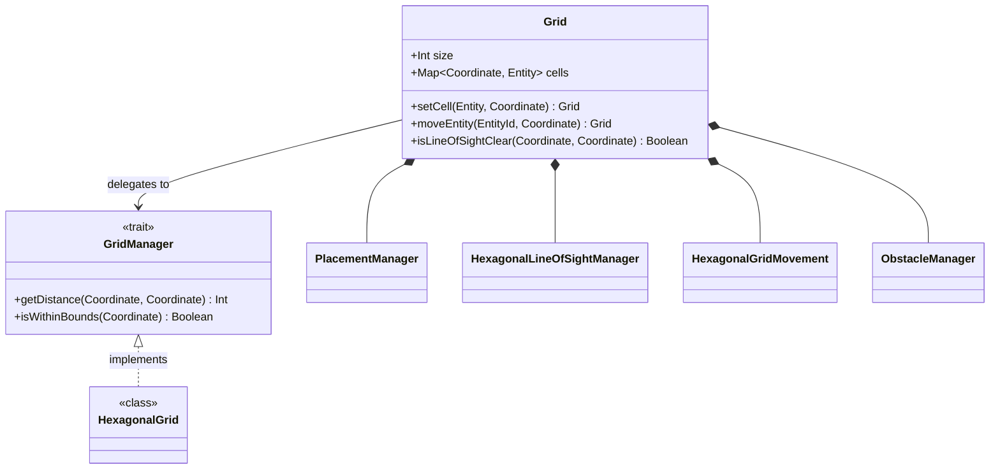
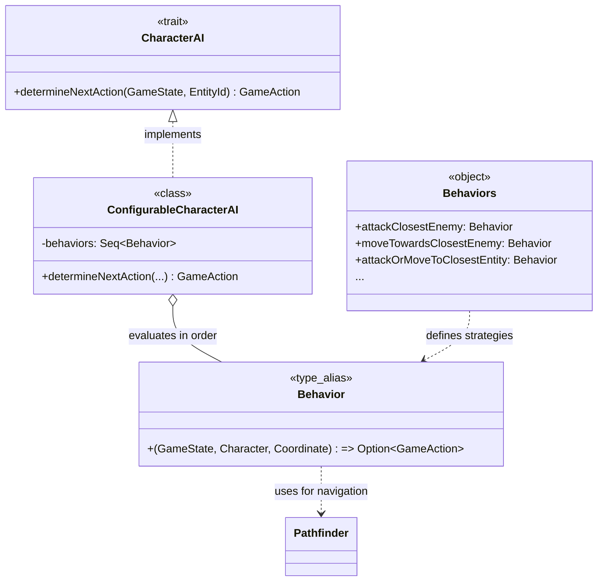
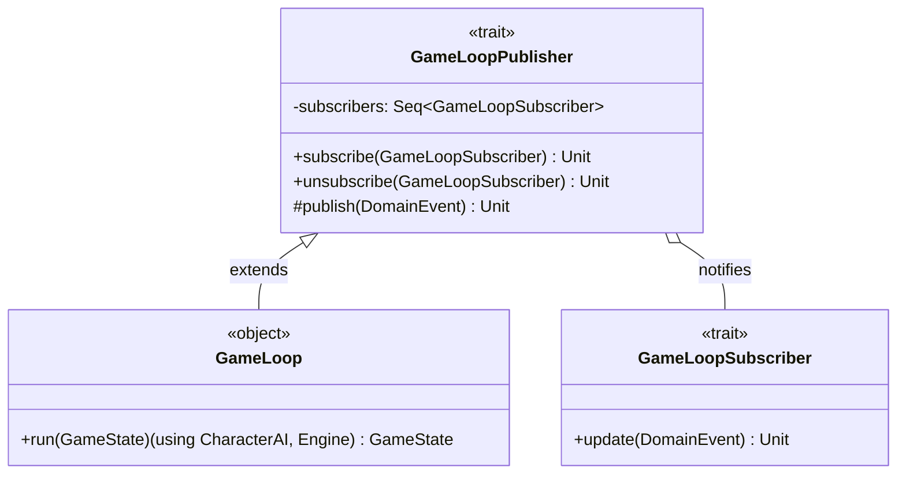
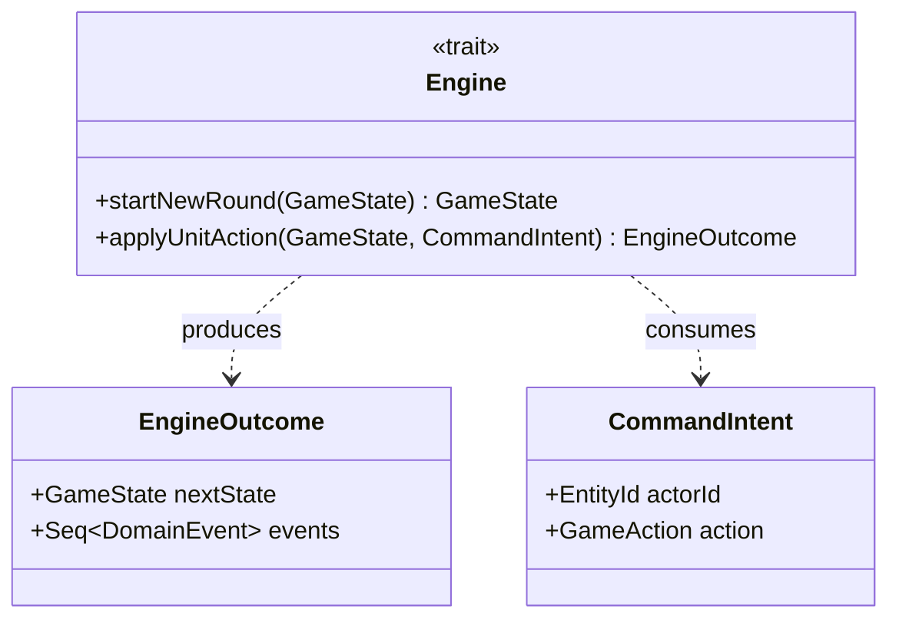

# Design di Dettaglio

L’architettura del sistema è progettata per garantire una chiara separazione delle responsabilità. 
La struttura è divisa logicamente nei tre moduli principali del pattern MUV, 
con una forte enfasi sulla *composizione*, *immutabilità* e *Domain-Driven Design*.

## Model (Dominio e Stato)

Il Model è il cuore del gioco e contiene le entità e le regole spaziali. 
Le classi principali sono state modellate sfruttando le potenzialità di Scala 3 (es. `enum`, `extension methods`).

### Entità di Gioco (Entities)
Le entità sono modellate tramite un *Algebraic Data Type* (ADT) chiuso, 
garantendo un controllo rigoroso a compile-time tramite il trait `sealed`.

La suddivisione tra `Character` e `Obstacle` permette di 
applicare pattern differenti: un ostacolo può essere passabile o meno (`isPassable`) e 
può opzionalmente ricevere danni (`Option[Int] hp`).

### Griglia e Posizioni
La mappa di gioco (`Grid`) rappresenta un punto focale. 
Invece di avere una classe monolitica, la classe `Grid` usa il pattern 
Delegation / Composition per orchestrare logiche complesse 
(movimento esagonale, visuale, collisioni).

La `Grid` espone un'interfaccia pulita ma internamente delega le responsabilità
(es. `HexagonalLineOfSightManager` calcola il raggio visivo). 
Essendo una `case class` immutabile, operazioni come `moveEntity` ritornano una nuova istanza di 
`Grid` con la mappa `cells` aggiornata.

### CharacterAI
Un modulo che gestisce l'intelligenza artificiale dei personaggi,
decidendo le azioni da intraprendere in base allo stato del gioco.
Invece di adottare pesanti gerarchie orientate agli oggetti, il design di questo
modulo sfrutta un approccio marcatamente funzionale, combinando Pattern Strategy e Chain of Responsibility
attraverso funzioni pure e immutabili.

### Lo Stato di Gioco (GameState)

Il `GameState` aggrega la griglia, la coda dei turni (`turnQueue`) e la fase attuale (`GamePhase`).
È l'unica "fonte di verità" immutabile passata all'`Engine`.

## Update (Logica di Gioco)

L'Update agisce da coordinatore centrale, gestendo il
flusso del gioco e orchestrando le interazioni tra Model e
View.
Il componente `GameSetup` si occupa di inizializzare lo
stato del gioco, mentre il `GameLoop` gestisce l'evoluzione
del gioco, processando gli _input_ e aggiornando il modello di
conseguenza.

### GameLoop

Il flusso di esecuzione del gioco è governato dall'oggetto `GameLoop`, 
che non utilizza i tradizionali cicli imperativi (`while(true)`),
ma adotta una funziona ricorsiva (_tail_) su stati immutabili. 
Inoltre, per comunicare con l'esterno (View, Logger) senza creare dipendenze dirette, 
sfrutta il pattern **Observer**.

Come si vede dal diagramma `GameLoop` fa utilizzo del componente `CharacterAI` (mostrato [sopra](#characterai)) 
e dell'Engine (che mostreremo in [seguito](#engine)), ma non ha alcuna dipendenza diretta da View o Logger.

### Engine

Il modulo di Update ruota attorno al trait `Engine`, che funge da risolutore di azioni (`Action Resolver`).
Le azioni vengono rappresentate come `CommandIntent`, che incapsulano l'intenzione di un attore (es. un personaggio) 
di compiere un'azione specifica (es. `Move`, `Attack`).
L'intento viene generato dalla CharacterAI, mentre l'`Engine` si occupa di validare e applicare le regole di gioco, 
restituendo un `EngineOutcome` che contiene il nuovo stato e gli eventi di dominio generati.    

## View (Input/Output)
La View si appoggia agli eventi restituiti dall'`EngineOutcome` e interroga il `GameState` 
in sola lettura per effettuare il rendering.
Le classi (es. `DisplayGrid`, `ConsoleGameLogger`) operano interpretando le coordinate esagonali e 
mappandole in un _output_ visivo per l'utente, isolando così l'I/O dal Functional Core del sistema.
