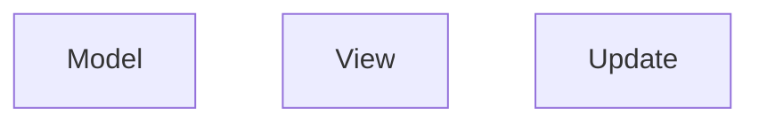

## Design di dettaglio

Scelte rilevanti di design, pattern di progettazione, 
organizzazione del codice -- corredato da pochi ma efficaci
diagrammi

L’architettura del sistema è progettata per garantire una 
chiara separazione delle responsabilità tra i diversi 
componenti. La struttura modulare permette di mantenere 
distinti la gestione dei dati e della logica di gioco, 
l’interfaccia utente e il coordinamento delle operazioni.
Questa organizzazione favorisce la manutenibilità del 
codice, facilita eventuali modifiche e assicura un flusso 
ordinato delle informazioni attraverso i vari livelli del 
sistema, dalla raccolta dell’input utente fino all’
aggiornamento dello stato di gioco e alla sua 
visualizzazione.

### Interazione tra i componenti
Nel diagramma seguente è possibile vedere come i vari 
componenti del sistema interagiscono fra di loro ad alto 
livello. 

TBD

### Design del Model
Il Model rappresenta il cuore logico del gioco, articolato
in più moduli che riflettono le entità fondamentali del 
dominio: ai, engine, entities, grid e input/output.
Ciascuna entità è modellata come un componente indipendente
ma interconnesso, con interfacce ben definite per 
promuovere modularità e coerenza.

Il componente **GameState** funge da contenitore centrale
per lo stato del gioco, mantenendo traccia di tutte le 
informazioni rilevanti, come la mappa, le unità, le 
statistiche e i turni. La mappa è rappresentata come una 
griglia esagonale, con classi dedicate per gestire le 
celle, gli ostacoli e le unità posizionate su di essa. Le 
unità sono modellate con le loro statistiche e abilità, e 
sono organizzate in fazioni per facilitare la gestione 
delle interazioni tra di esse.

### Design del Update
L'Update agisce da coordinatore centrale, gestendo il 
flusso del gioco e orchestrando le interazioni tra Model e
View.
Il componente **GameSetup** si occupa di inizializzare lo 
stato del gioco, mentre il GameLoop gestisce l'evoluzione
del gioco, processando gli input e aggiornando il Model di 
conseguenza.
Il **GameLoop** è progettato per essere efficiente e 
reattivo, garantendo un'esperienza di gioco fluida, anche 
con un numero elevato di unità e interazioni in corso.

### Design della View
La View si occupa di mostrare le informazioni di gioco al
player e della raccolta degli input. Predispone i metodi 
al Update per la renderizzazione degli elementi di gioco.
Il suo design è stato pensato per essere disaccoppiato 
dalla logica di gioco. 
