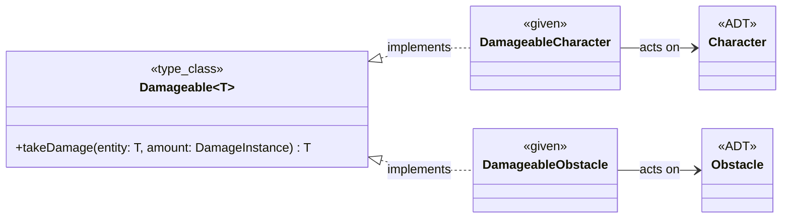

# Implementazione - Pedrini Fabio

Il mio contributo al progetto si è concentrato principalmente sulla
progettazione e implementazione delle seguenti sezioni:
- Modellazione del dominio:
    - Definizione delle Entità di gioco (`Character`, `Obstacle`)
      e delle loro caratteristiche.
    - Implementazione delle statistiche dei personaggi.
- Input/Output:
    - Progettazione e implementazione dell'interfaccia utente,
      inclusa la visualizzazione delle unità e del combattimento.
    - Gestione dell'input da parte dell'utente per il posizionamento
      delle unità (con relativa fase di setup).
    - Logging delle azioni di gioco ed eventi significativi.

## Modellazione del dominio:

### Entità
Per modellare gli elementi che popolano la griglia di gioco, si è scelto
di utilizzare degli Algebraic Data Types (ADT). L'interfaccia base è stata
definita come un `sealed trait Entity`, generando un dominio chiuso.

La relazione tra `Entity`, `Character` e `Obstacle` è stata definita e
rappresentata nella sezione di [design di dettaglio](../05-detailed-design.md).

`Character` e `Obstacle` sono stati implementati come `case class` che 
estendono `Entity`, permettendo di ottenere personaggi e ostacoli con
caratteristiche e/o statistiche (`Stats`) immutabili.
Questa modellazione ha permesso alle entità di agire come puri contenitori
di dati, senza incorporare logica di business complessa al loro interno.

All'interno dell'oggetto `Entity` è presente una factory per creare
le entità di gioco, ognuna con il proprio metodo (es. `Entity.archer`,
`Entity.wall`), centralizzando la logica di costruzione e mantenendo
il codice pulito e organizzato.

Sono state implementate anche le `enum` per definire i ruoli dei 
personaggi (`Role`), la fazione a cui appartengono (`Faction`) e i 
tipi di ostacoli (`ObstacleType`), fornendo un set di valori 
predefiniti e limitati.
Inoltre, è stato creato un `opaque type EntityId` per rappresentare
l'identificatore di ogni entità, garantendo immutabilità e
incapsulamento.

### Damageable
Per gestire la logica di danno, è stato definito un trait generico 
`Damageable[T]` che rappresenta qualsiasi entità che può subire danni.
L'implementazione sfrutta il concetto di **type class**, permettendo di 
definire comportamenti specifici tramite i costrutti `given` e `extension`.




Tramite le istanze given, che implementano in modo differente il metodo
`takeDamage`, il motore di combattimento può determinare la logica di 
risoluzione dei danni specifica per un `Character` o per un `Obstacle`
senza conoscerne l'effettiva implementazione.
Questo design garantisce il rispetto dell'Open-Closed Principle (OCP): 
è possibile introdurre nuove entità e definire come subiscono i danni 
semplicemente aggiungendo un nuovo given, senza dover modificare il codice
delle entità preesistenti o dell'`Engine`.

## Gestione Input/Output

Per gestire l'interfaccia utente e la visualizzazione di gioco, è stata
progettata una sezione dedicata all'Input/Output. 

### IO, GameSetup
Si è scelto di utilizzare la **IO Monad** per gestire i side-effect 
legati all'input da console, sfruttando una computazione lazy. 
In questo modo, metodi come `IO.printLine` o `IO.readString` non 
stampano o leggono istantaneamente, ma restituiscono una struttura dati 
immutabile che descrive l'intenzione di compiere quell'azione in futuro.

Questa struttura (e l'implementazione dei metodi `map` e `flatMap`)
permette di comporre le operazioni utilizzando una **for-comprehension**, 
creando un flusso di computazione chiaro e leggibile.
Come visibile nella classe `GameSetup`, l'intero ciclo di posizionamento 
delle truppe è una concatenazione di operazioni:
```scala 3
def runSetupLoop(
      currentGrid: Grid,
      entityCounter: Int = 0
  ): IO[Grid] =
    for
      _ <- printMenu()
      _ <- IO.printLine("> ")
      userInput <- IO.readString()
      res <- processCommands(InputParser.parse(userInput), currentGrid, entityCounter)
      finalGrid <- if res._3 then runSetupLoop(res._1, res._2) else IO(() => res._1)
    yield finalGrid
```
- Stampa il menu e chiede l'input all'utente.
- Legge l'input e lo passa a `InputParser` per determinare l'azione
immessa dall'utente.
- `processCommands` elabora l'azione e restituisce una tupla con la
griglia aggiornata, il contatore delle entità inserite e un booleano che
indica se continuare con il ciclo di posizionamento.
- Se il booleano è `true`, la funzione richiama se stessa con la griglia 
aggiornata, altrimenti termina restituendo la griglia completa.

In questo modo, l'intero processo di setup è eseguito nel `Main` con
la chiamata del metodo `run()`:
```scala 3
val completeGrid = GameSetup.runSetupLoop(updatedGrid).run()
```

### InputParser, SetupCommand

L'`InputParser` svolge il ruolo di ponte tra le stringhe di testo
inserite dall'utente e il dominio di gioco.
Il suo unico compito è quello di ricevere un dato in ingresso (una 
`String`) e restituire un dato in uscita calcolato deterministicamente 
(una `List[SetupCommand]`).
Sulla stringa in ingresso viene applicata una regex, in modo tale
da estrarre tutte le occorrenze di comandi validi.
Questi gruppi di comandi vengono associati (tramite `match`) a un
`SetupCommand`, un ADT che rappresenta le azioni che l'utente può
compiere durante la fase di setup:
```scala 3
enum SetupCommand:
  case AddTroop(roleId: Role, position: Coordinate)
  case StartGame
  case Invalid(error: String)
```
- Inserire una truppa sulla griglia, specificando ruolo e posizione.
- Iniziare la simulazione (quindi terminare della fase di setup).
- Comando non valido.

I comandi vengono processati dalla funzione `processCommands` di
`GameSetup` che aggiorna la griglia di gioco, come descritto in
precedenza.

### ActionLog, LoggerUtils

La visualizzazione a terminale degli eventi di gioco è gestita da 
`ActionLog`, in modo tale da separare la logica di gioco da quella
di stampa.
Ad ogni `GameAction` (che rappresenta un evento di gioco), viene
associata una stringa descrittiva tramite il metodo `formatAction()`.
Facendo un override del metodo `toString()` di `ActionLog`, è
possibile ottenere una rappresentazione testuale personalizzata 
di ogni evento, in modo da descrivere all'utente l'andamento del
combattimento.

L'object `LoggerUtils` si occupa di stampare a terminale gli 
`ActionLog` utilizzando l'`IO` definita in precendenza:
```scala 3
def logAndDisplay(log: ActionLog): IO[Unit] =
    IO.printLine(log.toString).flatMap(_ => IO.sleep(3000))
```


## Altre sezioni in cui ho collaborato

Di seguito vengono riportate alcune classi in cui ho collaborato, 
specificando il mio contributo:

- `CharacterAI`: creazione di una nuova AI (`CleanerCharacterAI`) 
alternativa a quella di default (`BasicCharacterAI`). Questa AI
agisce da "pulitore", attaccando l'entità più vicina a sè, 
che questa sia un nemico o un ostacolo, mentre quella di default 
cerca di attaccare il nemico più vicino, ignorando gli ostacoli.


- `Behaviors`: implementazione effettiva dell'IA sopracitata
definendo il metodo `attackOrMoveToClosestEntity`, il quale cerca
tra le entità vicine i nemici e gli ostacoli che si possono 
distruggere. Se sono in range, li attacca, altrimenti si muove
verso di essi.


- `Pathfinder`: implementazione del metodo `reachableCellsWithin`
insieme ad Lorenzo Zanetti. In particolare, il metodo è stato 
modificato per permettere alle entità con `movementSpeed > 1` di 
saltare gli ostacoli con `isPassable = true`, rendendo più fluida
la navigazione sulla griglia di gioco.


- `Lane`: implementazione insieme ad Alessandro Zanzi del 
piazzamento strategico di truppe nemiche, cioè suddividendo in 
corsie/fasce/`Lane` la griglia di gioco e posizionando le truppe
con più vita e attacchi corpo a corpo nelle corsie più vicine al 
centro, mentre quelle con meno vita e attacchi dalla distanza nelle
corsie più lontane.


- `LineOfSightManager`: implementazione insieme ad Alessandro Zanzi 
della gestione del range di attacco delle truppe, rimuovendo entità 
nascoste da ostacoli che bloccano la visione (`blocksVision = true `)
e che si trovano in mezzo alle due entità.


- `DisplayGrid`: implementazione del metodo di visualizzazione
della legenda (`displayLegend()`) per riconoscere truppe e 
ostacoli nella stampa di inizio partita.


- `Coordinate`: implementazione dell'`opaque type` per rappresentare
le posizioni nella griglia, con aggiunta di extension methods `x` 
e `y` per accedere alle coordinate.
