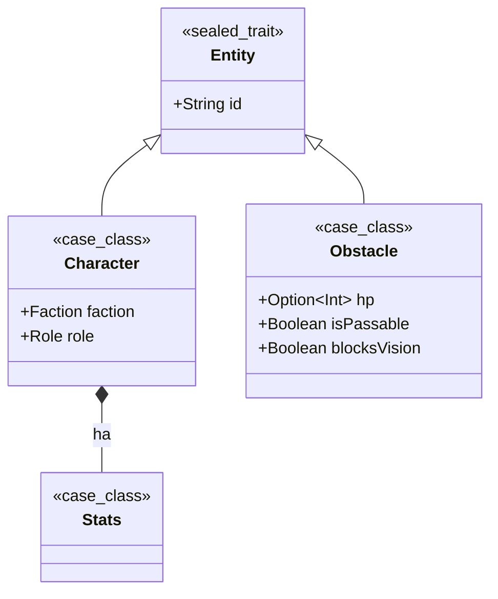
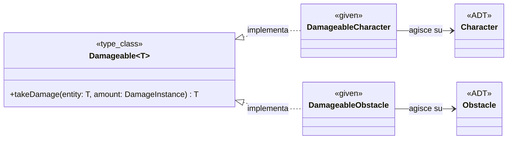

## Implementazione - Pedrini Fabio

Il mio contributo al progetto si è concentrato principalmente sulla
progettazione e implementazione delle seguenti sezioni:
- Modellazione del dominio:
    - Definizione delle Entità di gioco (Characters, Obstacles)
      e delle loro caratteristiche.
    - Implementazione delle statistiche dei personaggi.
- Input/Output:
    - Progettazione e implementazione dell'interfaccia utente,
      inclusa la visualizzazione delle unità e del combattimento.
    - Gestione degli input da parte dell'utente per il posizionamento
      delle unità e altre interazioni.

#### Modellazione del dominio:

Per modellare gli elementi che popolano la griglia di gioco, si è scelto
di utilizzare degli Algebraic Data Types (ADT). L'interfaccia base è stata
definita come un sealed trait Entity, generando un dominio chiuso.

Entity-Character-Obstacle:

Damageable:

#### Gestione Input/Output

MonadIO, InputParser, Logging, GameSetup, Main

#### Altre sezioni in cui ho collaborato

CharacterAI, Behaviour, Grid/DisplayGrid, LineOfSightManager
