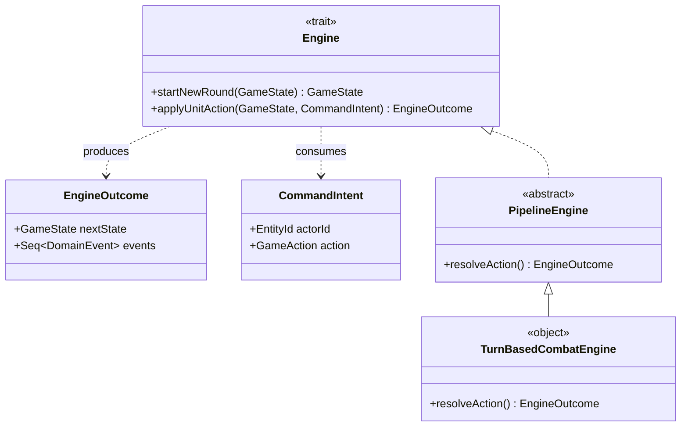

# Implementazione - Zanetti Lorenzo

Il mio contributo al progetto si è concentrato principalmente sulla
progettazione e implementazione delle seguenti sezioni:

- Model:
  - CharacterAI
  - Pathfinding
  - Behaviors
  - GameState / GameAction / DomainEvent
  - Damage / CombatRules
- Update:
  - GameLoop
  - Engine

Con la collaborazione sporadica (aggiunta di funzioni di utilità o piccoli refactor) su:

- Model:
  - Entity
  - Character
  - Obstacle
  - Grid

## CharacterAI e Behaviors

L'intelligenza artificiale delle entità è stata sviluppata privilegiando la composizione di funzioni pure. 
Alla base del modulo troviamo `Behavior`, definita come una funzione che analizza lo stato attuale 
e restituisce un'azione opzionale:

```scala
type Behavior = (GameState, Character, Coordinate) => Option[GameAction]
```

Tramite la classe `ConfigurableCharacterAI` è possibile passare una sequenza di questi comportamenti, 
implementando una variante funzionale dei pattern _Strategy_ e _Chain of Responsibility_. 
Al momento di decidere l'azione, il motore valuta i comportamenti in modo _lazy_ concatenandoli. 
Questo approccio assicura che venga restituita la prima azione valida individuata e, 
nel caso in cui nessun comportamento restituisca un'azione, 
viene fornita un'azione di _fallback_ (`GameAction.Pass`).

Nell'oggetto `Behaviors` risiedono le vere e proprie logiche di comportamento, 
realizzate tramite l'utilizzo delle collection di Scala. Ad esempio:
* `attackClosestEnemy`
* `moveTowardsClosestEnemy`
* `attackOrMoveToClosestEntity`

### Pathfinding

TODO

### Regole di Combattimento e Danni (CombatRules)

La complessità del combattimento è gestita e isolata all'interno del modulo `CombatRules` e 
tramite le astrazioni modellate nel file `Damage.scala`.
I danni sono stati modellati con un'`enum DamageType` che può assumere i casi `Physical` o `Magical`.
Ogni attacco genera un `AttackProfile` composto da diverse

TODO: pezzetto di codice DamageInstance

il quale viene poi valutato in relazione alle difese specifiche del bersaglio (`physicalDefense` e `magicalDefence`).
Per la determinazione della validità di un attacco, la funzione `canAttack` sfrutta una _for comprehension_. 

TODO: mettere pezzetto di codice

La funzione di risoluzione (`resolveAttack`) utilizza, invece, la _higher-order function_ `foldLeft`
per iterare in successione tutte le `DamageInstance` contenute nel profilo d'attacco, 
applicando il danno misto e calcolando man mano i punti ferita risultanti prima di generare l'entità aggiornata.
Infine, per mantenere il resto della _business logic_ conciso e semantico, 
ho fatto grande uso degli _extension methods_. Alcuni esempi sono:
- `attacker.canAttack(target)`
- `targetObstacle.isDestroyed` 
- `damage.calculatedAgainst(stats)`

## GameState e Fasi di Gioco

Il concetto fondamentale alla base del motore è l'immutabilità dello stato.
Il sistema è stato modellato attorno alla `case class GameState`, la quale aggrega tre informazioni fondamentali:
- La fase attuale del gioco, modellata tramite l'`enum GamePhase` (`Setup`, `Combat`, `GameOver`).
- La griglia di gioco corrente (`Grid`).
- La coda dei turni attuale (`turnQueue`), rappresentata come una sequenza di `EntityId`.

Sfruttando l'immutabilità delle _case class_ in Scala, ogni aggiornamento 
(es. lo spostamento di un'unità o un attacco) non modifica lo stato corrente, 
ma genera una nuova istanza di `GameState` tramite il metodo `.copy()`.

All'interno di `GameState` sono state inoltre inserite le logiche per determinare lo stato 
di avanzamento della partita: metodi come `livingCharacters`, `remainingFactions` e `winningFaction` 
calcolano dinamicamente se è presente un vincitore analizzando le entità ancora in vita sulla griglia.

## Gestione dei Turni (TurnOrderManager)

L'inizializzazione e il mantenimento dell'ordine dei turni sono gestiti dal `TurnOrderManager`.
All'inizio di ogni nuovo round, viene invocato il metodo `determineTurnOrder`,
il quale estrae tutte le unità in vita dalla griglia e le ordina.

L'ordinamento viene effettuato primariamente in base alla velocità (`speed`)
del personaggio in ordine decrescente (`-character.stats.speed`).
A parità di velocità, per garantire un ordine deterministico,
le unità vengono ordinate tramite le loro coordinate di riga e colonna.

## Motore di Gioco (Engine)

Il modulo di Update ruota attorno al `trait Engine`, che funge da vero e proprio _Action Resolver_.
L'interazione tra la `CharacterAI` e il motore avviene tramite oggetti di tipo `CommandIntent`,
che incapsulano l'attore (`actorId`) e l'azione desiderata (`GameAction`).




L'`Engine` processa questi intenti e restituisce un `EngineOutcome`, una classe che contiene:
1.  Il `nextState` (il nuovo `GameState` immutabile).
2.  Una sequenza di `DomainEvent`
    (eventi generati come conseguenza dell'azione, utili per aggiornare la View in modo disaccoppiato).

Per rendere la risoluzione estendibile, è stato implementato il pattern _Pipeline_ in `PipelineEngine`.
Questo permette di concatenare una serie di `EngineRule` (funzioni `EngineOutcome => EngineOutcome`)
tramite `reduceLeft(_ andThen _)`, in modo da applicare regole globali post-azione
(ad esempio le regole standard di combattimento o il controllo della fine del gioco).
L'implementazione concreta di base è `TurnBasedCombatEngine`.

## Action Resolvers

La logica specifica di esecuzione delle azioni (`Pass`, `Move`, `Attack`) risiede nell'oggetto `ActionResolvers`.
Utilizzando ampiamente il **_pattern matching_**, l'engine smista i _CommandIntent_ verso le relative funzioni di risoluzione:

- `resolvePass`: Salta semplicemente il turno, invocando `consumeTurn` che rimuove l'attore dalla `turnQueue`.
- `resolveMove`: Verifica innanzitutto la validità della mossa tramite la funzione `validMove`.
  In caso positivo, genera un nuovo stato in cui l'entità è stata mossa e produce un evento di dominio `Move`.
- `resolveAttackAction`: Verifica tramite le regole di combattimento se l'attacco è effettuabile (`canAttack`).
  In seguito, applica i danni e verificà l'eventuale morte di alcune unità.
  Produce eventi di dominio `Attack` e `Death` a seconda dei risultati.

## GameLoop e GameLoopPublisher

Per orchestrare tutti questi componenti è stato realizzato il `GameLoop`. 

```scala
@annotation.tailrec
def run(currentState: GameState)(using ai: CharacterAI, engine: Engine): GameState =
    currentState.phase match
      case GameOver => currentState
      case Setup => run(currentState.copy(phase = Combat))
      case Combat =>
        currentState.turnQueue match
          case Nil => run(engine.startNewRound(currentState))
          case currentCharacterId :: _ =>
            val action = ai.determineNextAction(currentState, currentCharacterId)
            val outcome = engine.applyUnitAction(
              currentState,
              intent = CommandIntent(currentCharacterId, action)
            )
            run(outcome.nextState)
```

_Il metodo è stato leggermente semplificato per evidenziare la struttura generale del ciclo di gioco._

Sfruttando la _tail recursion_, il ciclo consuma lo stato corrente, 
genera una nuova azione utilizzando la `CharacterAI` passata come contesto e la applica utilizzando
l'`Engine` (sempre passato come contesto).

`GameLoop` estende poi `GameLoopPublisher` implementando il pattern **Observer**. 
Ad ogni iterazione, la coda degli eventi presente nell'`EngineOutcome` viene scorsa e ogni `DomainEvent` 
viene pubblicato verso i _subscribers_ (ad esempio i logger o la griglia su terminale). 
Questo design mi ha permesso di disaccoppiare completamente il nucleo funzionale del gioco 
(Model/Update) dagli effetti visivi e di Input/Output.

