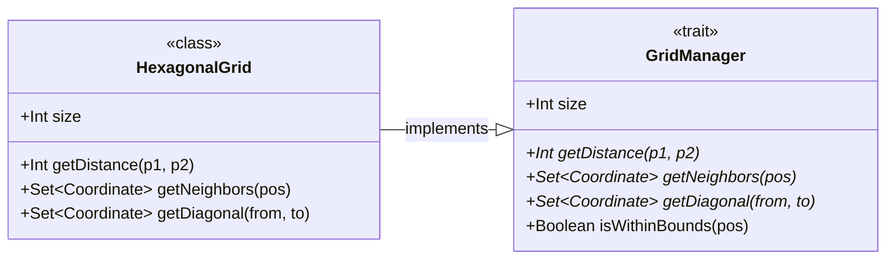
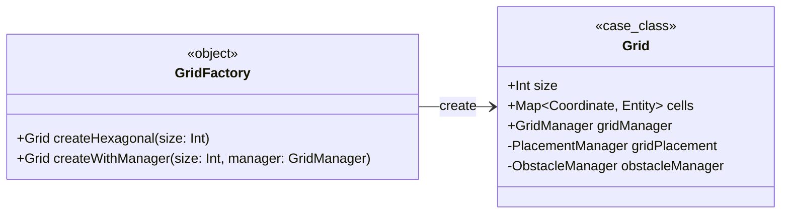
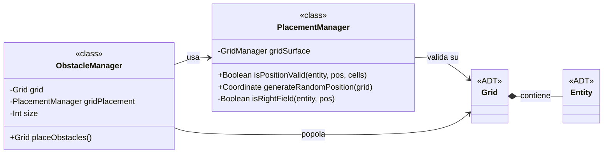
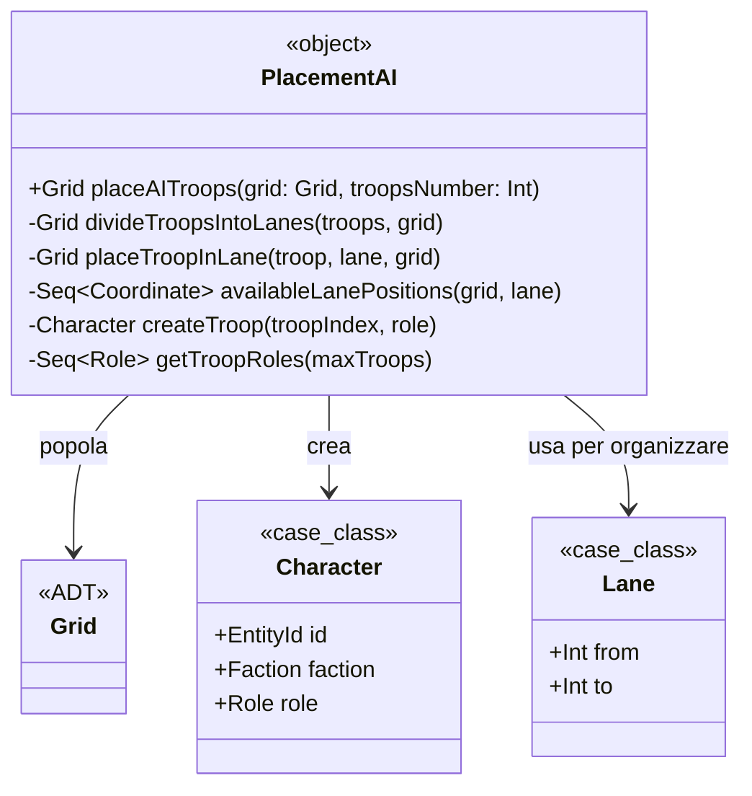
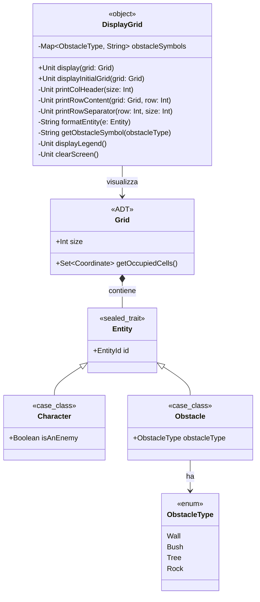

# Implementazione - Zanzi Alessandro
Il mio contributo al progetto si è concentrato principalmente sulla
progettazione e implementazione delle seguenti sezioni:
- Modellazione del dominio:
    - Definizione della Mappa di gioco(Grid) e di tutto 
    ciò che serve a gestire il posizionamento degli 
    elementi nelle sue celle; in particolare la logica 
    per validare e inserire unità alleate sulla mappa e 
    quella pe la disposizione automatica e valida delle 
    truppe nemiche.
    - Algoritmo per la generazione procedurale della 
    griglia, che permette di posizionare ostacoli o 
    terreni casuali.
    - Implementazione della logica di piazzamento di 
    truppe e ostacoli da parte del IA.
    - Implementazione della logica di controllo sull'
    occupazione della linea visiva tra due truppe.
- Input/Output:
    - Rappresentazione grafica 2D dell'arena e delle unità.

## Modellazione del dominio
La modellazione del dominio si concentra sulla
rappresentazione della mappa di gioco e sulla gestione
del posizionamento delle entità. La classe principale è
`Grid`, che rappresenta una griglia esagonale contenente
celle mappate da coordinate a entità. 

### Pattern di Programmazione
Scelta del pattern **Strategy** per gestire diversi 
tipi di griglia e favorire l'estendibilità del codice.
Attualmente, HexagonalGrid è l'unica implementazione, ma 
se in futuro vorremo supportare griglie quadrate, 
ottagonali o altre varianti, l'utilizzo di questo pattern 
permette al "contesto" (ad esempio, la classe Grid) 
sceglie dinamicamente quale strategia di griglia usare.

La griglia utilizza diversi manager per gestire aspetti 
specifici:

- **GridManager**: Interfaccia per la gestione della
  geometria della griglia, implementata da `HexagonalGrid`
  per calcolare distanze, vicini e diagonali in una
  griglia esagonale.
- **PlacementManager**: Gestisce la validazione del
  posizionamento delle entità, assicurando che alleati e
  nemici siano posizionati nei rispettivi campi (nemici in
  alto, alleati in basso) e che le posizioni siano libere
  ed entro i confini della mappa.
- **ObstacleManager**: Responsabile del posizionamento
  procedurale di ostacoli (muri, cespugli, alberi, rocce)
  sulla griglia, utilizzando posizioni casuali ma comunque
  validate.
- **PlacementAI**: Algoritmo per il posizionamento
  automatico delle truppe nemiche, che divide le truppe in
  corsie (fronte per soldati, medio per arcieri, retro per
  maghi) e le posiziona in posizioni disponibili casuali.

`GridManager` è il trait, `HexagonalGrid` è l'
implementazione concreta nella quale si definisce la 
logica per `getDistance`, `getNeighbours` e
`getDiagonal`, ovvero tutti quei metodi che dipendono 
dalla "forma" della griglia. La stessa strategia è stata 
applicata anche a `LineOFSightManager` e `GridMovement`.


Un altro patter utilizzato è **Factory**, per 
centralizzare la logica di creazione di istanze della 
griglia. Per farlo viene aggiunto `GridFactory`, un 
oggetto companion con metodi per creare istanze di Grid in 
modo centralizzato. A questo punto, il metodo
`createHexagonal` crea una griglia esagonale con le 
impostazioni predefinite.
Ciò permette di nascondere la complessità di costruzione, 
facilita l'aggiunta di validazioni (ad esempio, 
controllare che size > 0) o configurazioni future(es.
createSquare per griglie quadrate), e permette di 
restituire sottotipi senza esporli.


Per l'implemenatzione della griglia siamo partiti dalla 
classe `Grid`, inserendo tutte le operazioni al suo 
interno; questo l'ha resa una "God Class" con troppe 
responsabilità, perciò è stata rifattorizzata seguendo 
il **Single Responsibility Principle**, che ha prtato la 
struttura finale:
```
grid/
├── GridManager.scala (Gestione geografica mappa)
├── Grid.scala (Classe core)
├── GridFactory.scala (Factory)
├── PlacementManager.scala (Gestione posizionamento entità)
├── LineOfSightManager.scala (Gestione della vista)
├── EntityQuery.scala (Query e ricerca di entità)
├── GridMovement.scala (Movimento di entità)
└── ObstacleManager.scala (Gestione degli ostacoli)
```
Questo ha portato vari vantaggi: 
- Ogni classe ha una responsabilità unica
- Più facile testare singole funzionalità isolatamente
- Codice più facile da leggere e modificare
- Componenti indipendenti possono essere usati altrove
- Aggiungere nuove funzionalità non "sporca" la Grid

### Funzionamento
Il processo di generazione procedurale inizia con
`GridFactory`, che crea una griglia vuota, seguita dal
posizionamento di ostacoli tramite
`ObstacleManager.placeObstacles()`. Le truppe alleate
vengono posizionate manualmente dal giocatore, mentre
quelle nemiche vengono gestite da
`PlacementAI.placeAITroops()`.

#### Modellazione della Griglia:
Grid-Coordinate-GridManager:


Placement e Ostacoli:


Placement AI:


## Modellazione input/output

La rappresentazione grafica 2D dell'arena e delle unità è
gestita dalla classe `DisplayGrid`, che fornisce una
visualizzazione testuale della griglia in console.

La griglia viene visualizzata con intestazioni di colonna
e righe, utilizzando una disposizione che simula una
griglia esagonale. In un primo momento viene mostrata solo la
parte di griglia relativa all'utente, in seguito, una volta
che sono state piazzate le truppe viene mostrata la griglia
finale intera con tutti gli elementi al suo interno(truppe
alleate, truppe nemiche e ostacoli).

#### DisplayGrid e Visualizzazione:



## Altre sezioni in cui ho collaborato

- GridMovement: Gestione del movimento delle entità sulla griglia
- LineOfSightManager: Calcolo della linea di vista tra due posizioni
- EntityQuery: Query sulle entità presenti nella griglia
- Coordinate: Modellazione delle coordinate esagonali
