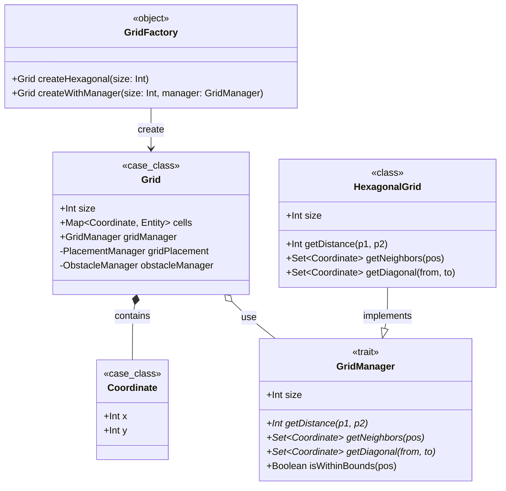
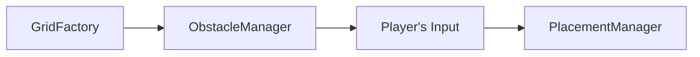
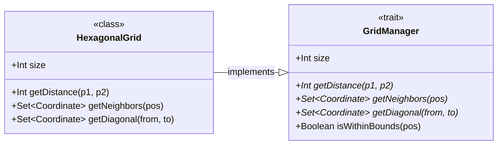
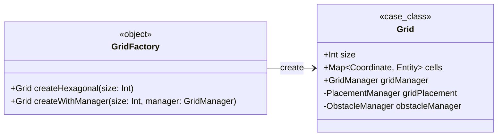

# Implementazione - Zanzi Alessandro
Il mio contributo al progetto si è concentrato 
principalmente sulla progettazione e implementazione delle 
seguenti sezioni:
- Modellazione del dominio:
    - Definizione della Mappa di gioco(Grid) e di tutto 
    ciò che serve a gestire il posizionamento dei vari 
    elementi nelle sue celle; in particolare, la logica 
    per validare e inserire una entità
    - Algoritmo per la generazione procedurale della 
    griglia, che permette di posizionare ostacoli o 
    terreni casuali
    - Implementazione della logica di piazzamento di 
    truppe e ostacoli da parte del IA
    - Implementazione della logica di controllo sull'
    occupazione della linea visiva tra due truppe
- Input/Output:
    - Rappresentazione grafica 2D dell'arena e delle unità

## Modellazione del dominio
La modellazione del dominio si concentra sulla
rappresentazione della mappa di gioco e sulla gestione
del posizionamento delle entità. La classe principale è
`Grid`, che rappresenta una griglia esagonale contenente
celle mappate da coordinate ed entità.

### Modellazione della Griglia:
Per l'implementazione della griglia sono partito dalla
classe `Grid`, inserendo tutte le operazioni al suo
interno; questo l'ha resa una "God Class" con troppe
responsabilità, perciò è stata rifattorizzata seguendo
il **Single Responsibility Principle**, che ha portato alla
struttura finale:
```
grid/
├── GridManager.scala (Gestione geografica mappa)
├── Grid.scala (Classe core)
├── GridFactory.scala (Factory)
├── PlacementManager.scala (Gestione posizionamento entità)
├── LineOfSightManager.scala (Gestione della vista)
├── EntityQuery.scala (Query e ricerca di entità)
├── GridMovement.scala (Movimento di entità)
└── ObstacleManager.scala (Gestione degli ostacoli)
```
Questo ha portato vari vantaggi:
- Ogni classe ha una responsabilità unica
- Più facile testare singole funzionalità isolatamente
- Codice più facile da leggere e modificare
- Componenti indipendenti possono essere usati altrove
- Aggiungere nuove funzionalità non "sporca" la Grid

La modellazione della griglia è organizzata in un package 
dedicato (`it.unibo.tosab.model.grid`), composto da classi 
e trait che collaborano per gestire la struttura della 
mappa, il posizionamento delle entità e degli ostacoli.

#### Interazioni tra i file principali

- `Grid.scala`: Classe core che rappresenta la 
griglia come una `case class` immutabile, contenente una 
mappa di coordinate a entità. Incapsula istanze private di
`PlacementManager`, `ObstacleManager`, `LineOfSightManager` 
e `GridMovement` (inizializzato lazy per efficienza, 
ritardando l'inizializzazione fino al primo uso). 
Delega operazioni specifiche a questi manager, ad esempio 
`setCell` usa `PlacementManager.isPositionValid` per 
validare il posizionamento, mentre `placeObstacles` chiama 
`ObstacleManager.placeObstacles()`.

- `PlacementManager.scala`: Classe che gestisce la 
validazione del posizionamento. Riceve un `GridManager` 
nel costruttore per accedere a metodi geometrici come 
`isWithinBounds`. È usato da `Grid.setCell` e da 
`ObstacleManager` per generare posizioni casuali valide. 
Utilizza pattern matching per distinguere alleati da nemici 
basandosi sul campo `x` della coordinata.

- **`ObstacleManager.scala`**: Classe responsabile del 
posizionamento procedurale di ostacoli. Dipende da 
`Grid` (per accedere alle celle occupate), 
`PlacementManager` (per generare posizioni valide) e 
`size` (numero di ostacoli). Nel metodo `placeObstacles`, 
usa un ciclo `for` per posizionare ostacoli casuali, 
aggiornando la griglia in modo immutabile a ogni iterazione.

- `GridManager.scala` e `HexagonalGrid.scala`: 
`GridManager` è un `trait` che definisce l'interfaccia per 
operazioni geometriche. `HexagonalGrid` è l'implementazione 
concreta per griglie esagonali. `Grid` usa un'istanza di 
`GridManager` per delegare calcoli di distanza e vicinanza.

- **`GridFactory.scala`**: Oggetto companion che fornisce 
metodi factory per creare istanze di `Grid`, nascondendo 
la complessità di costruzione e permettendo configurazioni 
future.

Altri file come `EntityQuery.scala`, `GridMovement.scala` 
e `LineOfSightManager.scala` supportano query, movimento e
visibilità, integrandosi con `Grid` attraverso delegazione.


### Funzionamento
#### Creazione della Griglia
Il processo inizia con `GridFactory.createHexagonal(size)`,
che crea un'istanza di `Grid` immutabile con dimensioni
specifiche (nel nostro caso 8x8). La griglia viene
inizializzata con una mappa vuota (`cells: Map.empty`),
contenente solo il riferimento al `GridManager`
(implementazione esagonale) utilizzato per operazioni
geometriche. A questo punto, la griglia ancora non contiene
entità.

#### Posizionamento Procedurale degli Ostacoli
Successivamente, viene invocato
`ObstacleManager.placeObstacles()` sulla griglia vuota.
Questo manager:
- Determina un numero casuale di ostacoli da generare
  (da 0 a `size`)
- Itera attraverso questo numero con un ciclo `for`,
  creando una sequenza immutabile di aggiornamenti
- A ogni iterazione, utilizza
  `PlacementManager.generateRandomPosition()` per generare
  coordinate casuali
- Valida ogni posizione tramite
  `PlacementManager.isPositionValid()`, assicurando che sia
  libera e dentro i limiti della mappa
- Crea un ostacolo casuale usando pattern matching sulla
  probabilità
- Aggiorna la griglia tramite
  `grid.setCell(obstacle, position)`, restituendo una nuova
  istanza immutabile

#### Posizionamento Manuale delle Truppe Alleate
A questo punto, il gioco entra in una fase interattiva in
cui il giocatore posiziona manualmente le truppe alleate.
L'interfaccia utente (attraverso
`DisplayGrid.displayInitialGrid`) mostra una
visualizzazione parziale della griglia, permettendo al 
giocatore di vedere solo la propria metà del campo.

Quando il giocatore posiziona un'unità alleata:
- `Grid.setCell(entity, position)` viene invocato con l'
  unità e la posizione desiderata
- `PlacementManager.isPositionValid()` valida la richiesta
  verificando:
  - Che la posizione sia entro i confini della griglia
    (`isWithinBounds`)
  - Che la cella sia libera (non occupata da entità od
    ostacoli)
  - Che la posizione sia nel campo degli alleati tramite 
  `isRightField`
- Se valida, la griglia viene aggiornata immutabilmente;
  altrimenti, rimane invariata (il metodo restituisce 
  `this`)

#### Posizionamento Automatico delle Truppe Nemiche
Una volta che il giocatore ha terminato il posizionamento,
il sistema invoca
`PlacementAI.placeAITroops(grid, troopsNumber)` che:
- Determina il numero di truppe da piazzare (solitamente
  da `GameSetup.getMaxNumberOfTroops`)
- Calcola una distribuzione di ruoli tramite
  `getTroopRoles()`, garantendo un mix bilanciato tra i 
  vari Characters
- Crea le truppe mediante `createTroop()`, assegnando ID
  univoci, la fazione `AI` e il ruolo specifico
- Ordina le truppe per HP decrescente, posizionando prima
  le unità più forti
- Divide le truppe in corsie (`divideTroopsIntoLanes`)
  basate sul ruolo:
  - **Soldati** → corsie anteriori (più vicine agli 
  avversari, migliore per il combattimento ravvicinato)
  - **Arcieri** → corsie centrali
  - **Maghi** → corsie posteriori (più lontane dagli 
  avversari)
- Per ogni truppa, utilizza `placeTroopInLane()` per
  posizionarla nella sua corsia:
  - Genera tutte le coordinate disponibili nella corsia
    tramite for-comprehension
  - Filtra le posizioni libere usando
    `grid.getEntity(position).isEmpty`
  - Randomizza l'ordine con `Random.shuffle()` per
    variabilità di gameplay
  - Seleziona la prima posizione disponibile con
    `headOption.map()`

#### Interazioni e Immutabilità
Ogni fase restituisce una nuova istanza di `Grid`
immutabile, permettendo:
- **Tracciamento dello stato**: Ogni modifica è una
  trasformazione esplicita
- **Annullamento/Ripetizione**: Se necessario, si può
  tornare a uno stato precedente senza effetti collaterali
- **Parallelismo**: Operazioni su griglie diverse possono
  essere eseguite senza sincronizzazione (futura feature)
- **Testing**: Ogni operazione è pura e deterministica se
  il seed casuale è controllato

Il flusso completo è il seguente(con ogni componente che
produce una nuova griglia che funge da input per il
successivo):


### Modellazione input/output
#### DisplayGrid
La rappresentazione grafica 2D dell'arena e delle unità è
gestita dalla classe `DisplayGrid`, che fornisce una
visualizzazione testuale della griglia in console.

La griglia viene visualizzata con intestazioni di colonna
e righe, utilizzando una disposizione che simula una
griglia esagonale. In un primo momento viene mostrata solo 
la parte di griglia relativa all'utente, in seguito, una 
volta che sono state piazzate le truppe viene mostrata la 
griglia finale intera con tutti gli elementi al suo interno
(truppe alleate, truppe nemiche e ostacoli).

## Pattern di Programmazione
### Strategy
Scelta del pattern **Strategy** per gestire diversi
tipi di griglia e favorire l'estendibilità del codice.
Attualmente, HexagonalGrid è l'unica implementazione, ma
se in futuro vorremo supportare griglie quadrate,
ottagonali o altre varianti, l'utilizzo di questo pattern
permette al "contesto" (ad esempio, la classe Grid)
sceglie dinamicamente quale strategia di griglia usare.

La griglia utilizza diversi manager per gestire aspetti
specifici:

- **GridManager**: Interfaccia per la gestione della
  geometria della griglia, implementata da `HexagonalGrid`
  per calcolare distanze, vicini e diagonali in una
  griglia esagonale.
- **PlacementManager**: Gestisce la validazione del
  posizionamento delle entità, assicurando che alleati e
  nemici siano posizionati nei rispettivi campi (nemici in
  alto, alleati in basso) e che le posizioni siano libere
  ed entro i confini della mappa.
- **ObstacleManager**: Responsabile del posizionamento
  procedurale di ostacoli (muri, cespugli, alberi, rocce)
  sulla griglia, utilizzando posizioni casuali ma comunque
  validate.
- **PlacementAI**: Algoritmo per il posizionamento
  automatico delle truppe nemiche, che divide le truppe in
  corsie (fronte per soldati, medio per arcieri, retro per
  maghi) e le posiziona in posizioni disponibili casuali.

`GridManager` è il trait, `HexagonalGrid` è l'
implementazione concreta nella quale si definisce la
logica per `getDistance`, `getNeighbours` e
`getDiagonal`, ovvero tutti quei metodi che dipendono
dalla "forma" della griglia. La stessa strategia è stata
applicata anche a `LineOFSightManager` e `GridMovement`.

### Factory
Un altro patter utilizzato è **Factory**, per
centralizzare la logica di creazione di istanze della
griglia. Per farlo viene aggiunto `GridFactory`, un
oggetto companion con metodi per creare istanze di Grid in
modo centralizzato. A questo punto, il metodo
`createHexagonal` crea una griglia esagonale con le
impostazioni predefinite.
Ciò permette di nascondere la complessità di costruzione,
facilita l'aggiunta di validazioni (ad esempio,
controllare che size > 0) o configurazioni future(es.
createSquare per griglie quadrate), e permette di
restituire sottotipi senza esporli.



## Altre sezioni in cui ho collaborato
- Behaviours: Gestione della visibilità tra due truppe
- Entities: Supporto decisionale all'organizzazione delle 
entità e delle loro caratteristiche